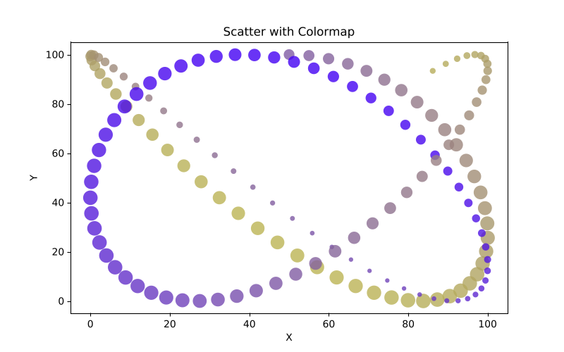
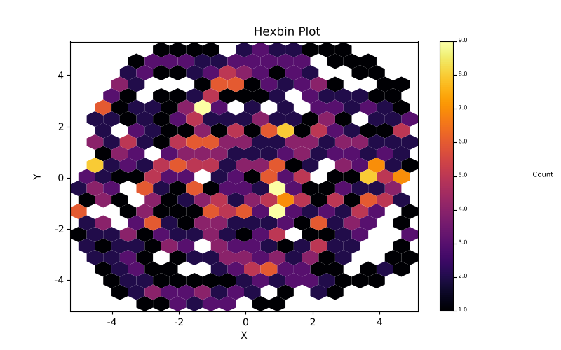
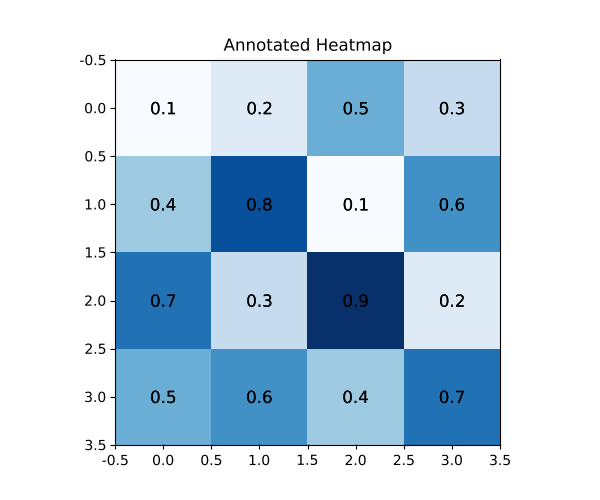
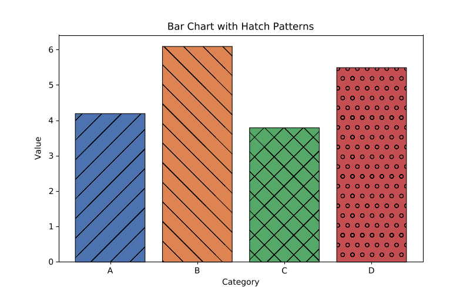

# cl-matplotlib

[](https://github.com/ynadji/cl-matplotlib/actions)

cl-matplotlib is a Common Lisp port of Python's [matplotlib](https://matplotlib.org), providing a pyplot-style API for creating publication-quality plots.

<p float="left">
  
  
</p>
<p float="left">
  
  
</p>

## Quick Start

```lisp
(use-package :cl-matplotlib.pyplot)

(figure)
(let ((x '(1 2 3 4 5))
      (y '(1 4 9 16 25)))
  (plot x y :label "y = x²")
  (xlabel "x")
  (ylabel "y")
  (title "Simple Plot")
  (legend)
  (savefig "/tmp/plot.png"))
```

## Install

### Prerequisites
- Common Lisp (SBCL or CCL)
- [Quicklisp](https://www.quicklisp.org/)

### Setup
Clone this repository into your Quicklisp local-projects directory, then:

```lisp
(ql:quickload :cl-matplotlib-pyplot)
```

## Documentation

- [API Reference](https://ynadji.github.io/cl-matplotlib/) — generated by [Staple](https://shinmera.github.io/staple/)
- [Visual Comparison Report](https://ynadji.github.io/cl-matplotlib/comparison_report/png/) — side-by-side comparison with Python matplotlib reference images (89/92 plots passing ≥ 0.95 SSIM)

## License

MIT License — see [LICENSE](LICENSE) for details.
