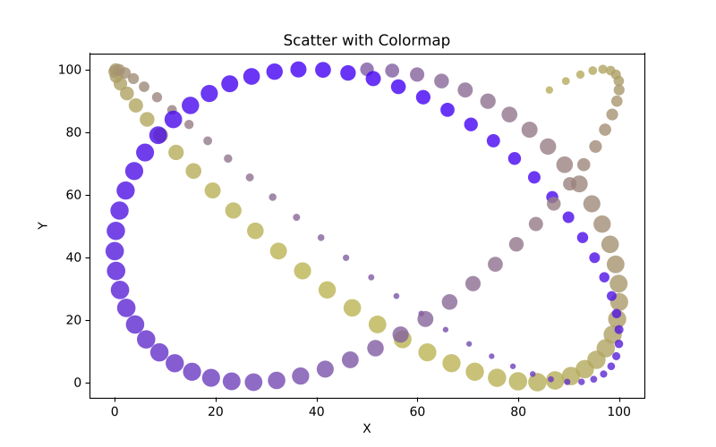
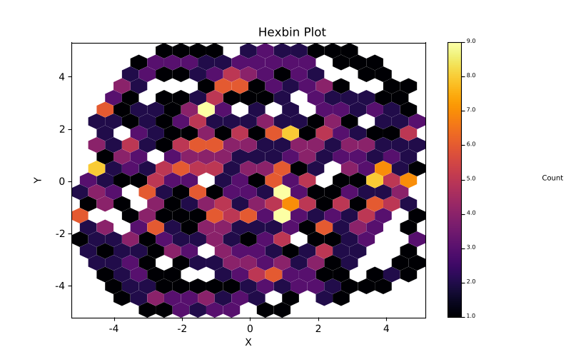
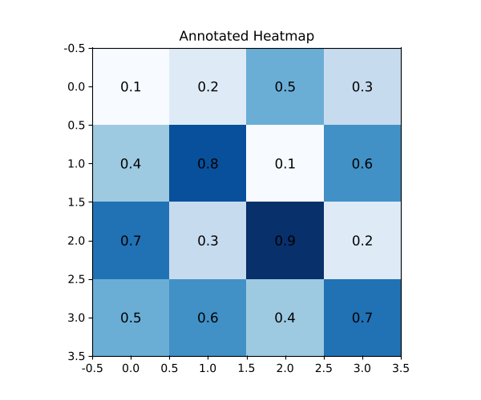
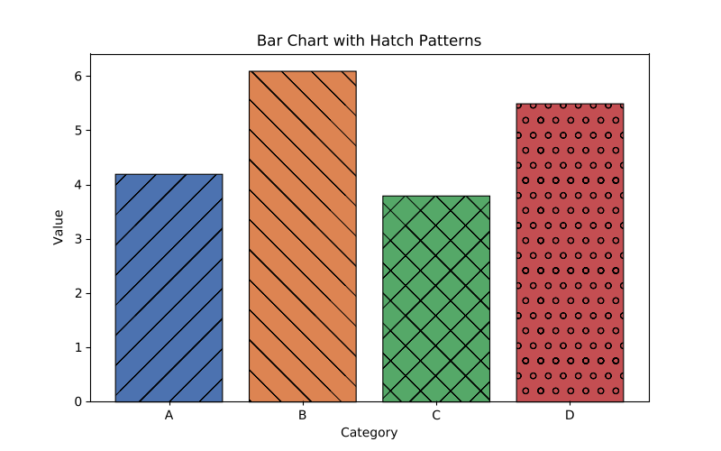

# cl-matplotlib

[](https://github.com/ynadji/cl-matplotlib/actions)

cl-matplotlib is a Common Lisp port of Python's [matplotlib](https://matplotlib.org), providing a pyplot-style API for creating publication-quality plots.

<p float="center">
  
  
</p>
<p float="center">
  
  
</p>

## Install

### Prerequisites
- Common Lisp (SBCL or CCL)
- [Quicklisp](https://www.quicklisp.org/)

### Setup
Clone this repository into your Quicklisp local-projects directory, then:

```lisp
(ql:quickload :cl-matplotlib-pyplot)
```

## Example Plot

```lisp
(ql:quickload :cl-matplotlib)
(use-package :cl-matplotlib.pyplot)

(figure)
(let ((x '(1 2 3 4 5))
      (y '(1 4 9 16 25)))
  (plot x y :label "y = x²")
  (xlabel "x")
  (ylabel "y")
  (title "Simple Plot")
  (legend)
  (savefig "/tmp/plot.png"))
```

See the Lisp files in [examples](examples/) for other plots.

## Interactive display (`show`)

Optional display backends open figures in live windows with
cursor-anchored zoom, drag pan, home/reset, save, and a data-coordinate
readout — in the browser (works over SSH) or a native SDL2 window:

```lisp
(ql:quickload :cl-matplotlib-show-web)   ; or :cl-matplotlib-show-sdl2
(use-package :cl-matplotlib.pyplot)

(plot '(1 2 3 4) '(1 4 2 3))
(show)              ; opens a browser tab / window
(show :block t)     ; returns when it is closed
```

See [docs/interactive.md](docs/interactive.md) for backend selection,
the interaction reference, and how to write a new display adapter.

## Grammar of Graphics (ggplot)

The `ggplot` system (package nickname `gg`) layers a ggplot2/plotnine-style
grammar on top of cl-matplotlib: plots are declarative values built from
data + aesthetic mappings + geoms/stats/positions + scales + facets +
themes, composed with the `stack` macro (the analogue of ggplot2's `+`):

```lisp
(ql:quickload :ggplot)

(gg:ggsave
 (gg:stack (gg:ggplot '(:wt #(2.6 2.9 3.2 3.4 4.1)
                        :mpg #(21.0 22.8 21.4 18.7 14.3)
                        :cyl #("4" "4" "6" "6" "8"))
                      (gg:aes :x :wt :y :mpg :color :cyl))
   (gg:geom-point :size 3)
   (gg:geom-smooth :method :lm)
   (gg:labs :title "MPG vs Weight" :x "weight" :y "miles per gallon")
   (gg:theme-minimal))
 "mpg.png")
```

`ggplot` and `aes` are generic functions: implement `gg:ggcolumns`,
`gg:ggcolumn`, and `gg:ggnrows` for your own data structure and every gg
feature works with it. Column alists/plists, hash-tables, lists of row
plists, and `gg:make-ggdata` array wrappers are supported out of the box.
`gg:qplot` gives one-line quick plots. Third-party geoms, stats,
positions, and scales plug in through the `gg.ext` extension package —
see [docs/gg-extending.md](docs/gg-extending.md).

Output parity is validated pixel-wise against
[plotnine](https://plotnine.org) with the same SSIM harness used for the
base library (`make gg-reference-images gg-images gg-compare-png`). See
[docs/gg-compat-matrix.md](docs/gg-compat-matrix.md) for implemented
geoms/stats/scales and per-example scores.

## Documentation

- [Visual Comparison Report](https://ynadji.github.io/cl-matplotlib/comparison_report/) — side-by-side comparison with Python matplotlib reference images (89/92 plots passing ≥ 0.95 SSIM)

## License

MIT License — see [LICENSE](LICENSE) for details. This was essentially translated by Claude, so it seems reasonable to keep the same license.

## Notes

This is largely an experiment to understand the process for translating a non-trivial program/library into another language.
